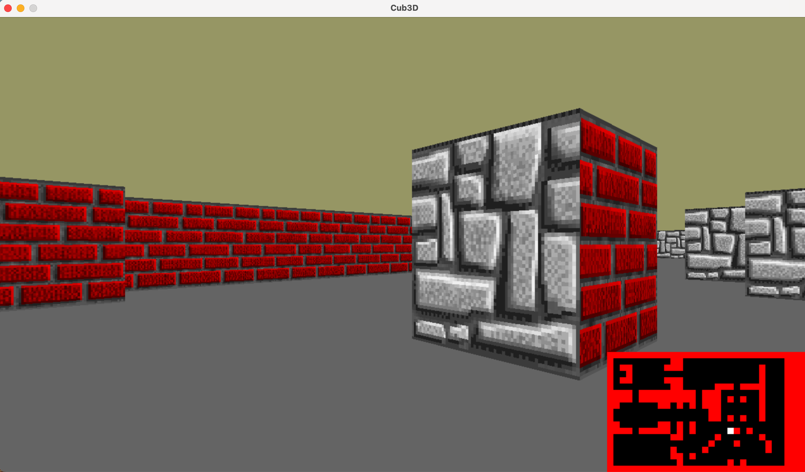

# cub3d

The goal is to make *something* using raycasting (like [Wolfenstein 3D](https://fr.wikipedia.org/wiki/Wolfenstein_3D)).

* WASD to move, rotate the point of view with the mouse or Left/Right directional keys
* ESC to quit
* Textures or colors for each sides (North, South, West, East) and Sky/Floor
* 3 different sprites
* Minimap
* Wall collisions

